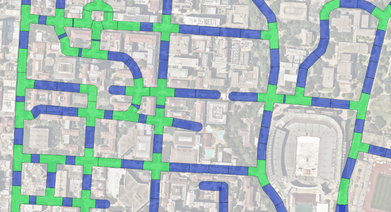

# dts-qgis-polygonizer

## Status

0.2 Release
## Background

The Vision Zero team, as part of the Austin Transportation and Public Works Department, operates a database of crashes in and around the Austin city limits. These's crashes are tracked by a point position, and in an effort to conduct analysis of the city's roadways in relation to crash location and crash severity, a set of polygons was created based on the street network. These polygons are of approximate equal area and have are formed in such a way that intersections are built into a single shape and interconnecting roads between intersections are divided into equal segments. By aggregating crashes into these polygons, comparisons become possible between intersections and road segments.

## Using the plugin

The software is available as an experimental plugin in the official QGIS plugin repository. Once installed, you will need a line network to use as input. Select the features you wish to polygonize, bring up the plugin's dock, adjust the sliders to your needs, and start the process. You'll receive a number of output layers created in a new group at the top of your layer tree. They are stored in memory, and will not persist though saves, so be sure to write them to disk if you want to keep them. They will be overwritten every time you re-invoke the polygonization process.

## Features to Implement

* [ ] Ensuring that polygons created do not overlap with each other by finding intersections between them and trimming polygon area where needed
* [ ] Intersection Leg snapping so that when intermediate segment lengths are sufficiently small, the legs of the intersections will extend to prevent tiny slivers of intersectional roadway polygons
* [ ] Bringing along attributes from the input line network to allow for polygons to be traced back to the constituent line segments that influenced their shape
* [ ] Ability to provide a typed-in, integer value to the process parameters
* [ ] Ability to designate a attribute of the input features which govern a set of presets for the polygon creation process parameters for that individual segment, such as `street_level` for example.
